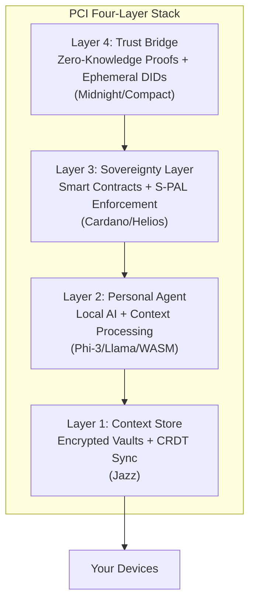
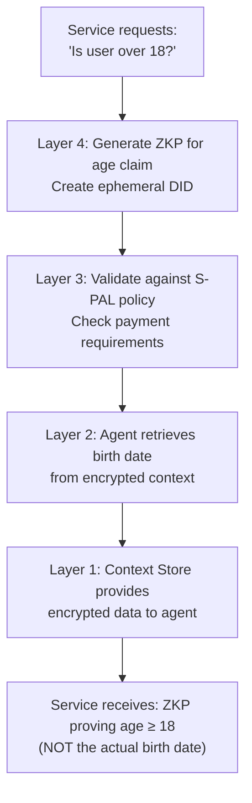

# PCI Architecture Overview

## The Four-Layer Sovereign Stack

Personal Context Infrastructure (PCI) is built on four integrated layers that work together to provide data sovereignty with cryptographic guarantees.

## Layer 1: Context Store

**Purpose:** Secure, encrypted storage of all personal data

**Key Components:**
- Encrypted vaults (AES-256-GCM)
- CRDT-based sync across devices
- Vector embeddings for semantic search
- Local-first architecture

**Technology:** Jazz (jazz-tools)

**Data never leaves your control.** The Context Store is the foundation - all other layers build on top of locally-controlled data.

## Layer 2: Personal Agent

**Purpose:** AI processing without data leakage

**Key Components:**
- Local language models (3-8B parameters)
- Context retrieval and processing
- Policy validation
- Decision support

**Deployment Options:**
- Device-native (phone, laptop)
- WASM in browser
- Community node

**The agent thinks using your data but never exposes it.** External services interact with the agent, not your raw data.

## Layer 3: Sovereignty Layer

**Purpose:** Cryptographic enforcement of privacy rules

**Key Components:**
- S-PAL policy definitions
- Smart contract validators
- DID management
- On-chain enforcement

**Technology:** Cardano blockchain, Helios/Aiken

**S-PAL policies are mathematically enforced.** If a service violates your policy, the transaction fails. It's not a suggestion - it's physics.

## Layer 4: Trust Bridge

**Purpose:** Prove facts without revealing data

**Key Components:**
- Zero-knowledge proof generation
- Ephemeral identity creation
- Selective disclosure
- Verification without revelation

**Technology:** Midnight (Compact), ZK circuits

**Shadow profiles become impossible.** Every interaction uses a single-use identity. Services get verified facts, not traceable profiles.

## Data Flow Example

## Deployment Models

### Individual

User runs all components on personal devices. Maximum sovereignty, requires technical knowledge.

### Family/Friend Node

Small group shares infrastructure. One technical person manages for extended group.

### Community Node

Organizations (libraries, co-ops, local businesses) run infrastructure for members. Professional management, local governance.

### Federation

Multiple communities interconnect for backup and resilience. Largest scale, delegated trust.

## Key Design Principles

1. **Local-First:** Data stays on user-controlled devices
2. **Cryptographic Guarantees:** Math enforces privacy, not policies
3. **Progressive Enhancement:** Works partially without full stack
4. **Community Operated:** Not dependent on any single entity
5. **Economically Sustainable:** Transparent costs, no data extraction

## Repository Map

| Repository | Layer | Purpose |
|------------|-------|---------|
| pci-spec | All | Specifications and schemas |
| pci-context-store | 1 | Encrypted vault implementation |
| pci-agent | 2 | Local AI agent |
| pci-contracts | 3 | Smart contract validators |
| pci-zkp | 4 | Zero-knowledge proof circuits |
