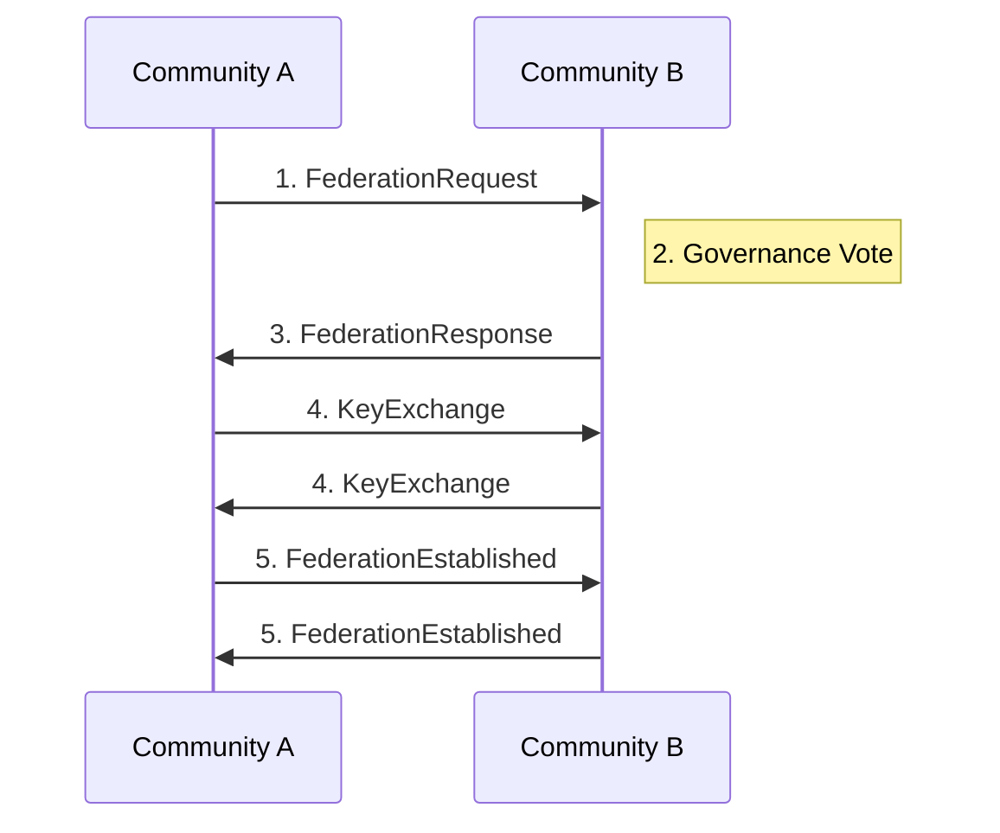

# Community Federation Protocol

Version: 1.0

## Overview

The Federation Protocol enables PCI community nodes to interconnect for backup, proof sharing, and collective governance. This creates resilience without centralization.

## Design Principles

- **No Single Point of Failure**: Any node can fail without data loss
- **Voluntary Participation**: Communities choose their federation partners
- **Privacy Preserving**: Federation doesn't expose user data
- **Economic Sustainability**: Shared costs, local benefits

## Federation Relationships

### Peer Types

| Type | Description | Trust Level |
|------|-------------|-------------|
| `backup_peer` | Stores encrypted backups | Medium |
| `proof_peer` | Shares cached proofs | Low |
| `governance_peer` | Participates in voting | High |
| `full_peer` | All capabilities | High |

### Establishing Federation



## Protocol Messages

### FederationRequest

```json
{
  "type": "FederationRequest",
  "from_community": "did:pci:community:barcelona-barri",
  "to_community": "did:pci:community:madrid-centro",
  "peer_type": "backup_peer",
  "capabilities": ["backup", "proof_cache"],
  "sla": {
    "uptime_guarantee": 0.99,
    "storage_offered_gb": 100,
    "bandwidth_mbps": 100
  },
  "governance_contact": "admin@barri.example.com",
  "timestamp": "2025-01-01T00:00:00Z",
  "signature": "..."
}
```

### FederationResponse

```json
{
  "type": "FederationResponse",
  "status": "accepted | rejected | pending_vote",
  "from_community": "did:pci:community:madrid-centro",
  "peer_type": "backup_peer",
  "sla_accepted": true,
  "public_key": "...",
  "endpoints": {
    "backup": "https://backup.madrid.pci.community",
    "proofs": "https://proofs.madrid.pci.community"
  },
  "signature": "..."
}
```

## Backup Synchronization

### Encrypted Backup Flow

1. User's agent encrypts context with user's key
2. Community node re-encrypts with federation key
3. Backup peer stores doubly-encrypted blob
4. Recovery requires both user key AND community key

### Sync Protocol

```
# Incremental sync (hourly)
POST /federation/backup/sync
{
  "community_id": "...",
  "since_timestamp": "...",
  "encrypted_deltas": [...]
}

# Full sync (daily, compressed)
POST /federation/backup/full
{
  "community_id": "...",
  "encrypted_snapshot": "..."
}
```

## Proof Sharing

Communities can share cached proofs to reduce computation:

```json
{
  "type": "ProofShareRequest",
  "proof_hash": "sha256:...",
  "claim_type": "age_over_18",
  "requester_community": "did:pci:community:...",
  "ttl": 3600
}
```

**Rules:**
- Only share proofs for common claims (age, location, etc.)
- Never share proofs for sensitive data
- Proof caching reduces ZKP computation by ~70%

## Governance Integration

Federated communities can delegate voting power:

```json
{
  "type": "GovernanceDelegate",
  "from_community": "did:pci:community:small-town",
  "to_community": "did:pci:community:regional-hub",
  "scope": ["template_standards"],
  "duration": "P1Y",
  "revocable": true
}
```

## Security Model

### Trust Boundaries

- Federation peers NEVER see plaintext user data
- All inter-community traffic is TLS 1.3 + certificate pinning
- Communities maintain independent key hierarchies
- Audit logs are immutable and cross-signed

### Failure Modes

| Scenario | Impact | Recovery |
|----------|--------|----------|
| Peer offline | Reduced redundancy | Auto-failover to other peers |
| Peer compromised | Encrypted data exposed | Revoke federation, re-key |
| Network partition | Sync delayed | Automatic reconciliation |

## Economic Model

Federation is not free:

- **Storage**: $0.01/GB/month
- **Bandwidth**: $0.001/GB
- **Proof computation**: $0.0001/proof

Payments via x402 between community treasuries.
