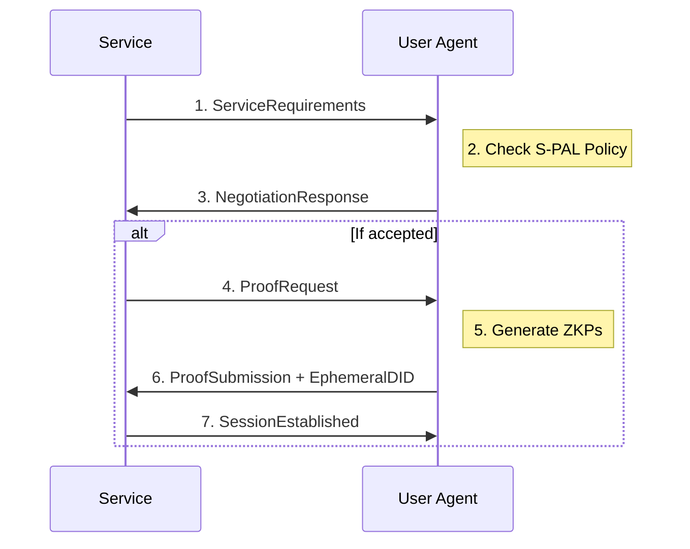

# S-PAL Negotiation Protocol

Version: 1.0

## Overview

The S-PAL Negotiation Protocol defines how services and user agents negotiate data access terms before any data is exchanged. This ensures both parties agree on privacy guarantees before interaction begins.

## Participants

- **User Agent**: The PCI Personal Agent acting on behalf of the user
- **Service**: An external service requesting access to user context

## Protocol Flow



## Message Types

### 1. ServiceRequirements

Service declares what data/proofs it needs:

```json
{
  "type": "ServiceRequirements",
  "service_did": "did:web:example.com",
  "timestamp": "2025-01-01T00:00:00Z",
  "requirements": [
    {
      "context_scope": "medical/allergies",
      "proof_type": "zkp",
      "claim": "has_no_allergy",
      "params": { "allergen": "penicillin" }
    }
  ],
  "retention_requested": 3600,
  "purpose": "Medical consultation",
  "signature": "..."
}
```

### 2. NegotiationResponse

User agent responds with compatibility status:

```json
{
  "type": "NegotiationResponse",
  "status": "accepted | rejected | negotiable",
  "policy_id": "spal:did:pci:...",
  "conflicts": [],
  "alternatives": [],
  "ephemeral_did": "did:pci:ephemeral:...",
  "signature": "..."
}
```

### 3. ProofSubmission

User agent provides requested proofs:

```json
{
  "type": "ProofSubmission",
  "ephemeral_did": "did:pci:ephemeral:...",
  "proofs": [
    {
      "claim": "has_no_allergy",
      "proof": "...",
      "verification_key": "..."
    }
  ],
  "payment_proof": "...",
  "signature": "..."
}
```

## Status Codes

| Status | Description |
|--------|-------------|
| `accepted` | Full compatibility, proceed with proofs |
| `rejected` | Incompatible requirements, cannot proceed |
| `negotiable` | Partial compatibility, alternatives available |

## Conflict Resolution

When requirements conflict with user policy:

1. Agent identifies specific conflicts
2. Agent suggests alternatives if available
3. Service may accept alternatives or abort
4. User is never prompted during automated negotiation

## Security Considerations

- All messages must be signed by sender
- Timestamps prevent replay attacks
- Ephemeral DIDs must be single-use
- No raw data exchanged during negotiation
